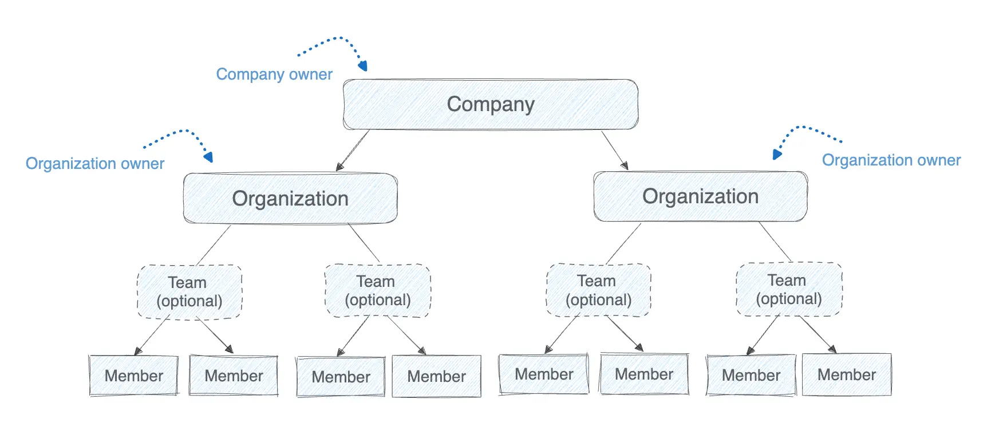

Administration

Administrators can manage companies and organizations using the
[Docker Admin Console](https://app.docker.com/admin). The Admin Console
provides centralized observability, access management, and security controls
across Docker environments.

## Company and organization hierarchy

The [Docker Admin Console](https://app.docker.com/admin) provides administrators with centralized observability, access management, and controls for their company and organizations. To provide these features, Docker uses the following hierarchy and roles.

### Company

A company groups multiple Docker organizations for centralized configuration.
Companies are only available for Docker Business subscribers.

Companies have the following administrator role available:

- Company owner: Can view and manage all organizations within the company.
Has full access to company-wide settings and inherits the same permissions as
organization owners.

### Organization

An organization contains teams and repositories. All Docker Team and Business
subscribers must have at least one organization.

Organizations have the following administrator role available:

- Organization owner: Can manage organization settings, users, and access
controls.

### Team

Teams are optional and let you group members to assign repository permissions
collectively. Teams simplify permission management across projects
or functions.

### Member

A member is any Docker user added to an organization. Organization and company
owners can assign roles to members to define their level of access.

> [!NOTE]
>
> Creating a company is optional, but organizations are required for Team and
Business subscriptions.

## Admin Console features

Docker's [Admin Console](https://app.docker.com/admin) allows you to:

- Create and manage companies and organizations
- Assign roles and permissions to members
- Group members into teams to manage access by project or role
- Set company-wide policies, including SCIM provisioning and security
enforcement

## Manage companies and organizations

Learn how to manage companies and organizations in the following sections.



- [Organization administration overview](https://docs.docker.com/admin/organization/)

- [Company administration](https://docs.docker.com/admin/company/)

- [Account and admin FAQ](https://docs.docker.com)
